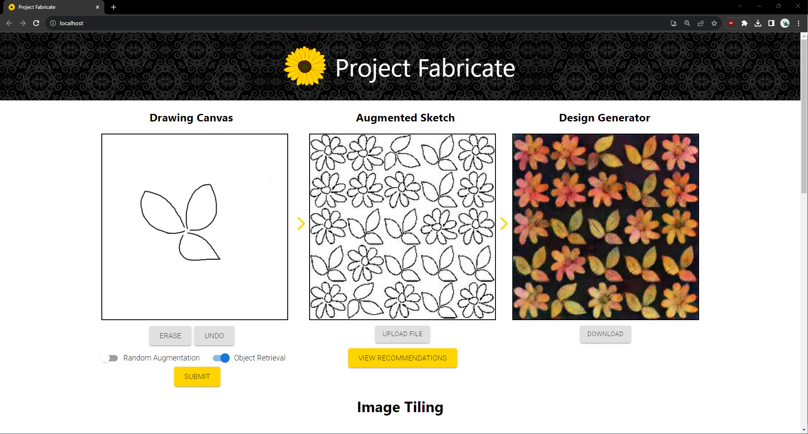
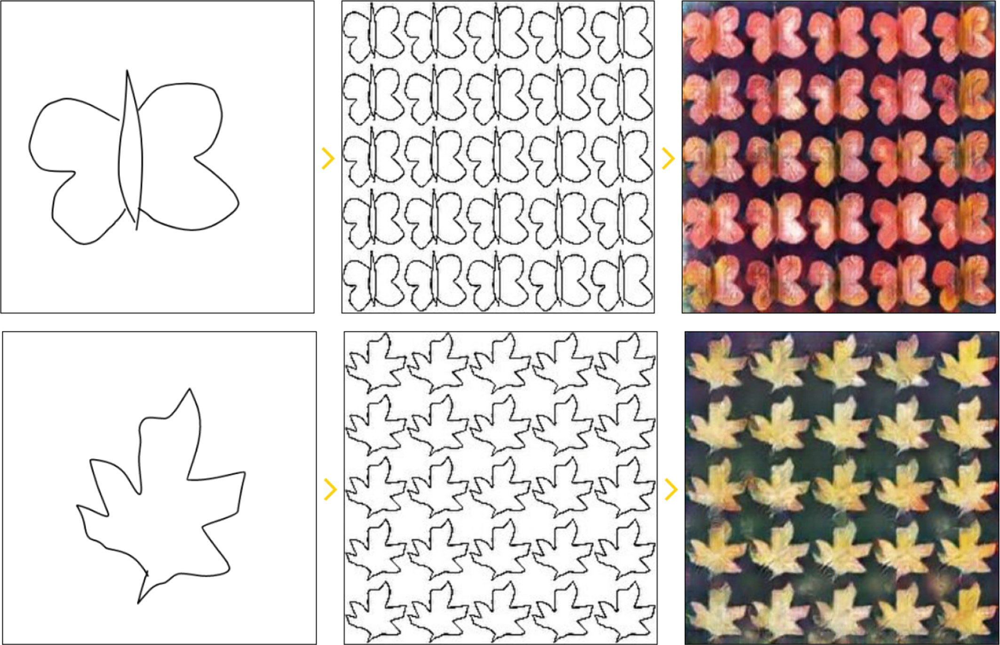
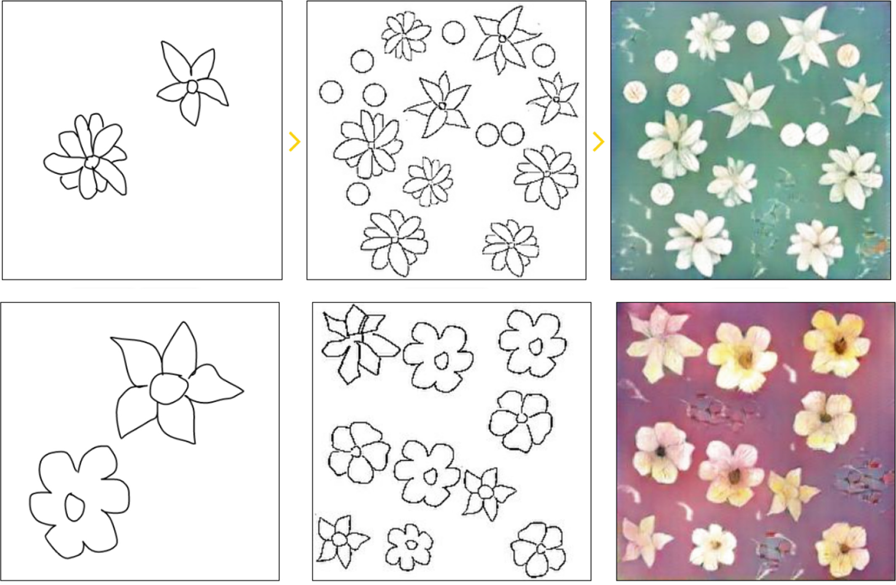

# Project Fabricate: Fabric Sketch Augmentation & Styling using Deep Learning & Image Synthesis Techniques



## 1. Introduction
This repository contains artifacts for the paper "Fabric Sketch Augmentation & Styling using Deep Learning & Image Synthesis Techniques", published in the conference proceedings for EvoMUSART 2023 ([link](https://doi.org/10.1007/978-3-031-29956-8_21)).

This repository contains the source code only for reference, but *does not* contain the model used for inference, nor the feature vectors for image retrieval. We include a Docker Compose file to allow running a local demo. For more details, please see [Section 2](#2-quick-start).

## 2. Quick Start
We provide a Docker Compose file to allow running the demo locally without any concern for dependencies. To start the demo, run:

```bash
$ docker compose up
```
The services for the UI and the backend run on ports `80` and `5000` respectively. Please ensure the ports are accessible on your host machine (the port for the UI may be modified from the `docker-compose.yml` file).

## 3. Results
Some results from the paper are shared here, with some example human inputs (left), their augmented results (center), and their generated designs (right).

### 3.1 Using Grid Style Augmentation


### 3.2 Using Random Augmentation


## 4. Datasets
We do not own any of the images in the dataset. The images were scraped from image banks such as Patternbank, The Sketchy Database and Kaggle Dataset for the 'butterfly', 'floral' and 'leaf' categories. The collected dataset was then
manually filtered to discard any images present which did not belong to the aforementioned categories.

The final dataset contains approximately 1500 images, with the final distibution for each category being ~500 images each.

## 5. Citation
If you find this code useful in your research, please cite using:
```
@inproceedings{ahmed2023fabric,
  title={Fabric Sketch Augmentation \& Styling via Deep Learning \& Image Synthesis},
  author={Ahmed, Omema and Abid, Muhammad Salman and Junaid, Aiman and Raza, Syeda Saleha},
  booktitle={International Conference on Computational Intelligence in Music, Sound, Art and Design (Part of EvoStar)},
  pages={327--340},
  year={2023},
  organization={Springer}
}
```
